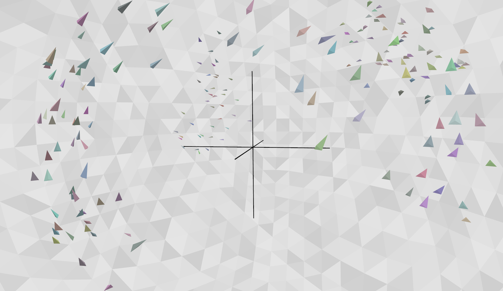

# flock



### new flock experiments

This is Yet Another implementation of the [boids](https://dl.acm.org/doi/10.1145/37402.37406) model of flocking and related group motions. It was meant just to be a workbench for thinking about new approaches to that old idea.

It is written in Python and Open3D. I started to use c++ and OpenGL, then thought better of it. That earlier start, now unused, is in the `cpp/` subdirectory.

I am not publicizing this very WIP code, but if you happen upon it and have any interest in using it, feel free to [email](mailto:cwr@red3d.com) me.

### Run simulation

After installation (below) simply invoke Python on the main file:

```
python flock.py
```

You can control the view using Open3D's standard gestures. There are also several single key commands to change modes. One is “h” which prints this mini-help on the shell:

```
  flock single key commands:
    space: toggle simulation run/pause
    1:     single simulation step, then pause
    c:     toggle camera between static and boid tracking
    s:     select next boid for camera tracking
    a:     toggle drawing of steering annotation
    w:     toggle between sphere wrap-around or avoidance
    e:     toggle erase mode (spacetime boid worms)
    f:     toggle realtime versus fixed time step of 1/60sec
    b:     toggle blend vs hard switch for obstacle avoidance
    o:     cycle through obstacle selections
    h:     print this message
    esc:   exit simulation.

  mouse view controls:
    Left button + drag         : Rotate.
    Ctrl + left button + drag  : Translate.
    Wheel button + drag        : Translate.
    Shift + left button + drag : Roll.
    Wheel                      : Zoom in/out.

  annotation (in camera tracking mode, “c” to toggle):
    red:     separation force.
    green:   alignment force.
    blue:    cohesion force.
    gray:    combined steering force.
    magenta: ray for obstacle avoidance.
```

### Known bugs (as of June 9, 2023)

Lots, since it is so preliminary, but for example:

- Because boids ignore global orientation, they are just as happy to move vertically as horizontally.
- The boid's “bodies” sort of look like they are shaded, but it is just painted on. It ought to be rendered to provide more orientation cueing.

### Installation

Clone this repository from GitHub to your local machine.

I have been using Python 3.10.10 with Open3D 0.17.0. I created a new Python enviroment like this:

```
conda create -n flock_open3d python=3.10
conda activate flock_open3d
pip install open3d
```

On my laptop (macOS 12.6.4 MacBook Pro M1) the above complained I was missing `libomp` so I also did:

```
brew install libomp
```

(Not sure if this is relevant but I had previously installed recent versions of `GLFW` and `GLEW` for the earlier c++/OpenGL branch. I assume Open3D installs what it needs.)
